# Hotel Management System 🏨

## 📌 Project Description

Hotel Management System is a web-based application designed to manage hotel operations efficiently. It includes features like room booking, check-in/check-out, food service management, and user authentication (admin and customers).

## ✨ Features

### Client Side

- **User Authentication** (Customers)
- **Room Booking & Management**
- **Check-in & Check-out System**
- **Food Ordering System**
- **User Dashboard for Booking Details**

### Admin Side

- **Admin Authentication & Dashboard**
- **Manage Rooms & Bookings**
- **Handle Check-ins & Check-outs**
- **Manage Food Orders**
- **View User Data & Reports**

## 🛠️ Technologies Used

- **Frontend:** HTML, CSS, JavaScript, Bootstrap
- **Backend:** Node.js, Express.js
- **Database:** MySQL


## 🚀 Installation & Setup

### Prerequisites

- Node.js installed
- MySQL installed
- Git installed

### Steps to Run Locally

1. **Clone the Repository:**

   ```bash
   git clone https://github.com/UmeshNayak1/Hotel-Management-System.git
   cd nayak-hotel-management
   ```

2. **Install Dependencies:**

   ```bash
   npm install
   ```

3. **Set Up MySQL Database:**

   - Create a database named `hotel`
   - Run the provided SQL script (`database.sql`) to set up tables

4. **Configure ****************************`.env`**************************** File:**\
   Create a `.env` file in the root directory and add:

   ```env
   DB_HOST=localhost
   DB_USER=root
   DB_PASS=yourpassword
   DB_NAME=hotel
   ```

5. **Start the Server:**

   ```bash
   node app.js
   ```

   or

   ```bash
   npm start
   ```

6. **Access the Application:**\
   Open [http://localhost:3000](http://localhost:3000) in your browser.

## 🛡️ Admin Login Credentials (Default)

- **Username:** `admin`
- **Password:** `admin` *(Change it for security!)*

## 📎 Folder Structure

```
Hotel-management-system/
│-- public/         # Static files (CSS, JavaScript)
│-- views/          # EJS templates for frontend
│-- routes/         # Route handlers
│-- models/         # Database models
│-- app.js          # Main server file
│-- package.json    # Dependencies
│-- README.md       # Project documentation
│-- .env.example    # Example environment variables
```

## 💎 Screenshots

### Client Side


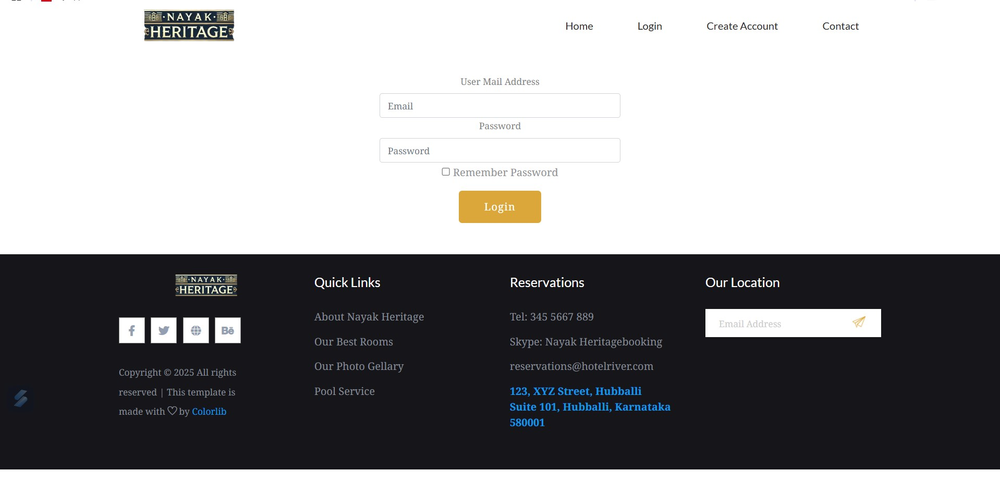
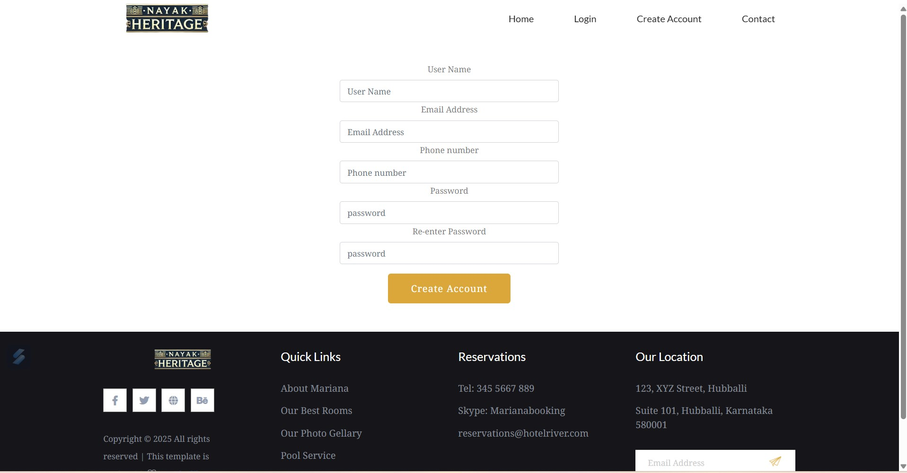
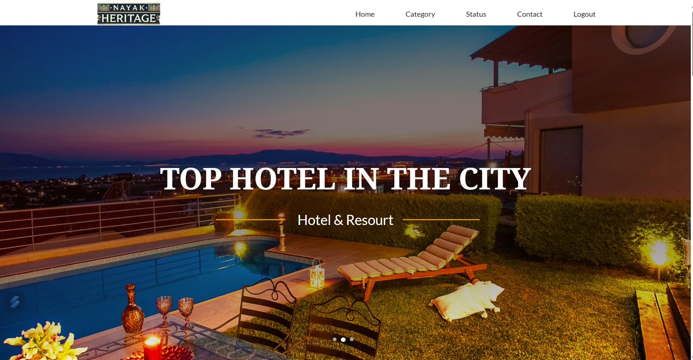
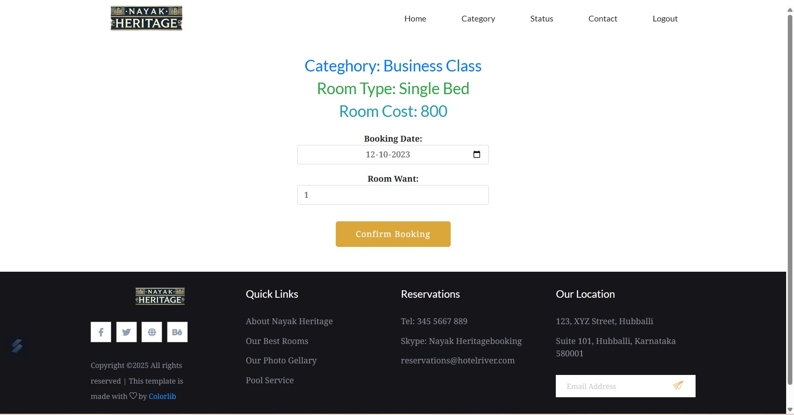
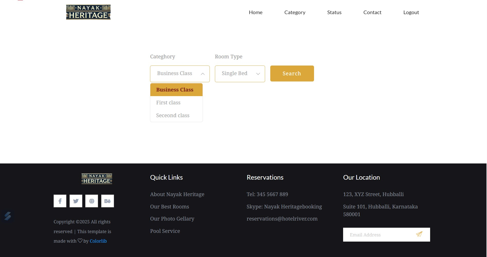
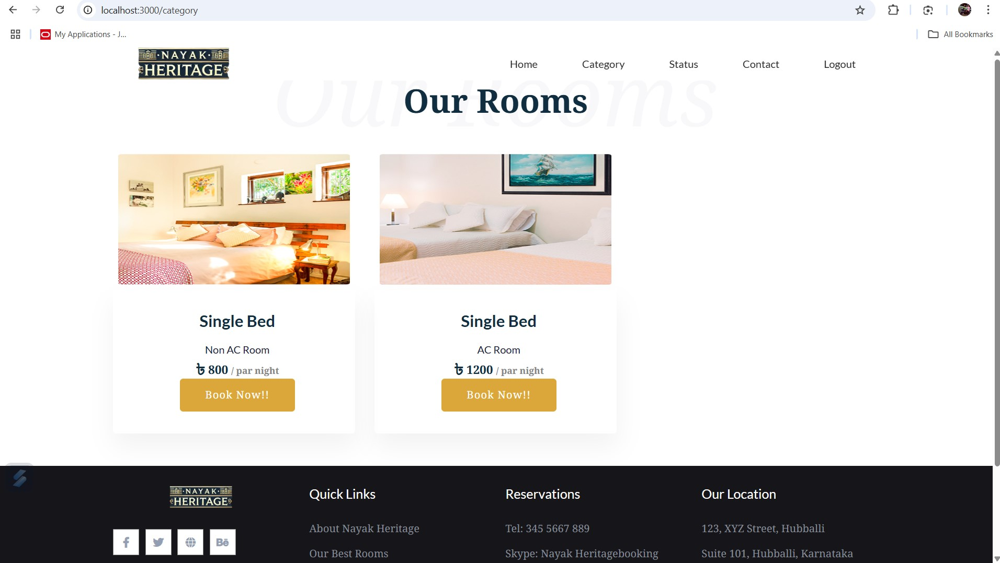
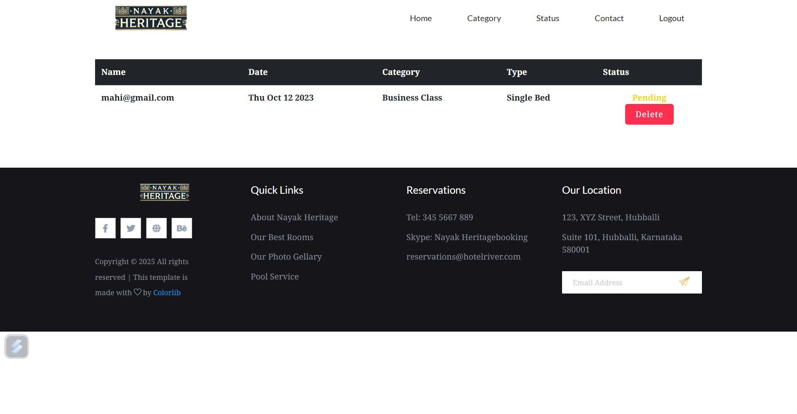
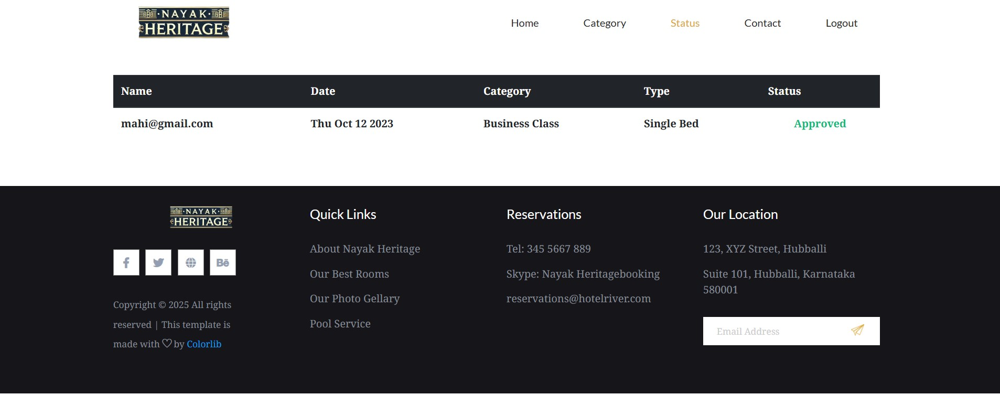
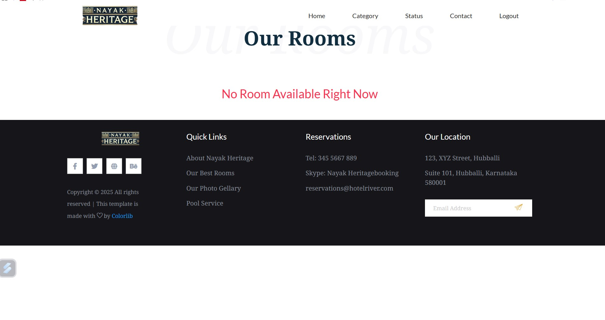
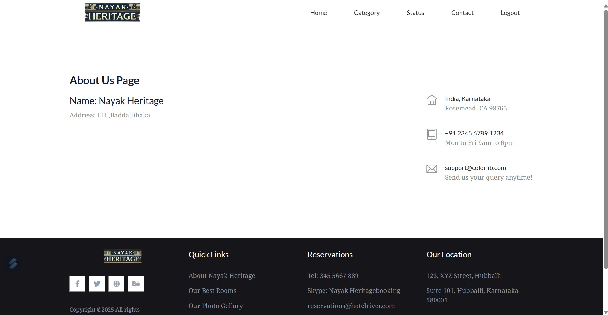
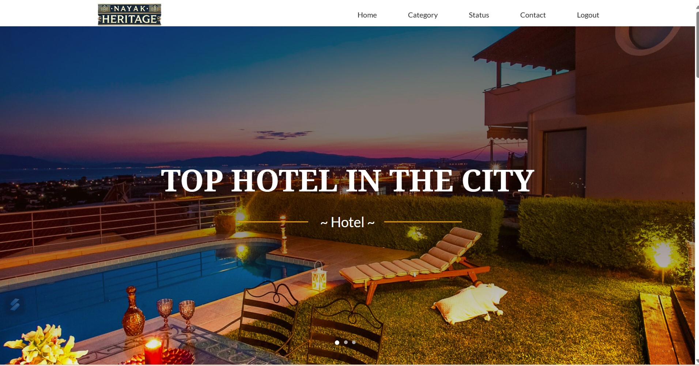


### Admin Side

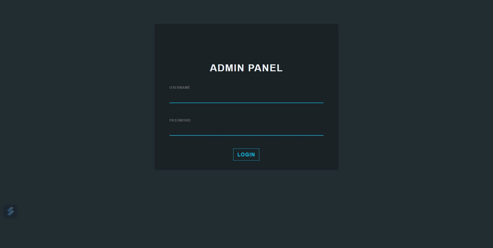
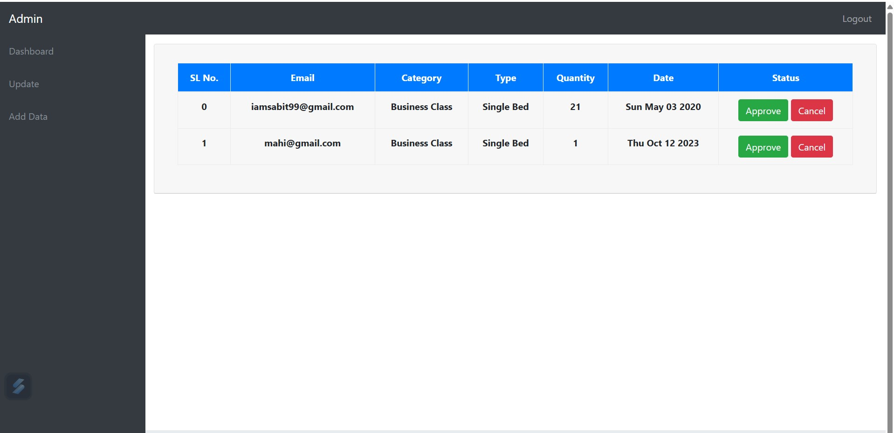
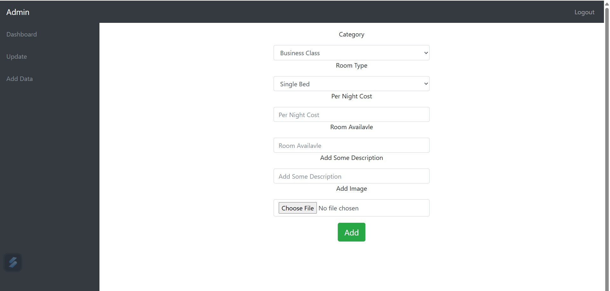
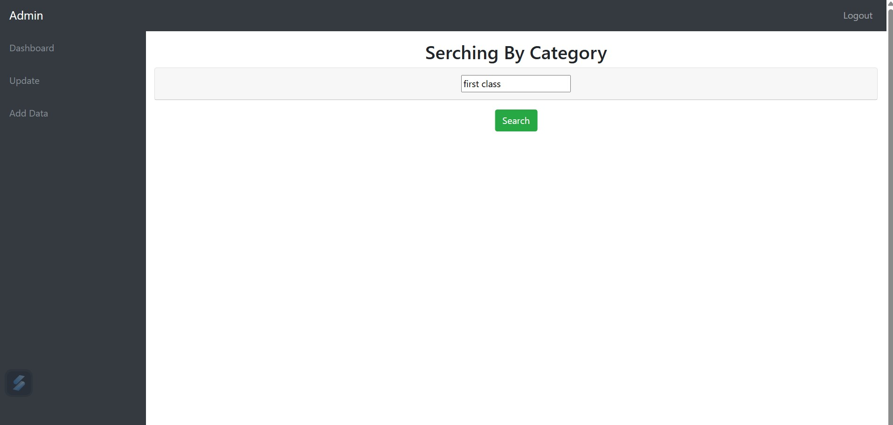
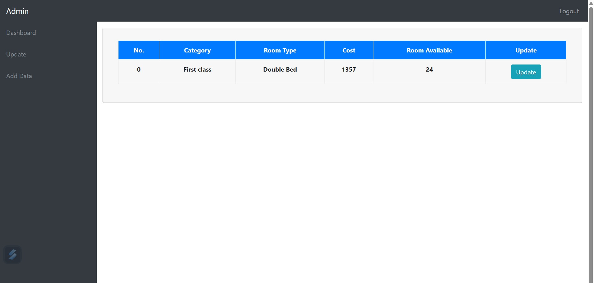

## 📝 Future Enhancements

- Implement role-based access control
- Add payment gateway integration
- Implement AI-based room recommendations


